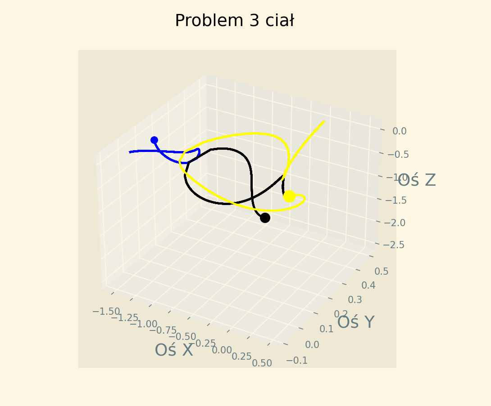

# ThreeBodiesProblem
## Symulacja Ruchu Trzech Ciał w Układzie Grawitacyjnym

**Wprowadzenie:**
Celem projektu było przedstawienie symulacji ruchu trzech ciał w układzie grawitacyjnym za pomocą numerycznych metod obliczeniowych. Symulacja ta opiera się na rozwiązaniu równań różniczkowych opisujących ruch trzech ciał pod wpływem sił grawitacyjnych, zgodnie z prawem grawitacji Isaaca Newtona.

**Metody:**
Do rozwiązania równań różniczkowych wykorzystano bibliotekę `scipy` w języku Python, która udostępnia funkcję `odeint` do numerycznego rozwiązywania równań różniczkowych. W symulacji wykorzystano również biblioteki `numpy` do obliczeń numerycznych oraz `matplotlib` do tworzenia wykresów i animacji.

**Parametry Symulacji:**
W symulacji przyjęto następujące parametry:
- Masa centralnego ciała: 1.989e+30 kg (masa Słońca)
- Prędkość początkowa: 30000 m/s
- Promień orbity: 5.326e+12 m
- Czas trwania symulacji: 70 lat (w przeliczeniu na sekundy)
- Stała grawitacyjna: 6.67408e-11 N*m^2/kg^2
- Masy trzech ciał: m1=5.0, m2=2.0, m3=1.0
- Początkowe prędkości i położenia trzech ciał

**Wyniki:**
Po rozwiązaniu równań różniczkowych otrzymano trajektorie ruchu trzech ciał w czasie. Wykorzystując bibliotekę `matplotlib`, stworzono wykresy 3D przedstawiające te trajektorie oraz animację, która wizualizuje ruch trzech ciał w czasie.

**Prezentacja Symulacji:**

---
*Autorzy: Projekt realizowany w zespołach 2 osobowych na potrzeby przedmiotu Fizyka*  

